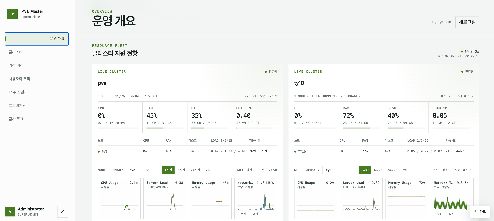

# PVE Master

PVE Master는 여러 Proxmox VE 클러스터의 상태와 VM/CT 수명주기, 조직별 소유권을 한곳에서 관리하는 운영 플랫폼입니다. 관리자는 클러스터와 인벤토리, 사용자·조직, IP 풀과 프로비저닝을 관리하고 고객은 자신이 속한 조직에 할당된 VM만 확인하고 제어할 수 있습니다.



## 요구 사항

- Docker Engine과 Docker Compose v2
- 로컬 개발 시 Python 3.12+, Node.js 20.9+

## Docker Compose로 실행

1. 환경변수 파일을 만들고 비밀값을 생성합니다.

   ```bash
   cp .env.example .env
   openssl rand -hex 32
   ```

   명령을 세 번 실행해 생성한 서로 다른 값을 `.env`의 `POSTGRES_PASSWORD`, `REDIS_PASSWORD`, `APP_SECRET_KEY`에 입력합니다. `APP_SECRET_KEY`는 최소 32자여야 합니다. `.env`는 Git에서 제외되며 예제 파일에는 실제 비밀값을 넣지 않습니다.

2. 개발 스택을 빌드하고 실행합니다.

   ```bash
   docker compose up --build -d
   docker compose ps
   ```

3. Alembic migration을 최신 revision까지 적용합니다. 모든 DB 변경은 Alembic revision으로 관리됩니다.

   ```bash
   docker compose exec backend alembic upgrade head
   ```

   최초 관리자는 비밀번호를 명령 인자로 넘기지 않는 대화형 CLI로 생성합니다.

   ```bash
   docker compose exec backend python -m app.cli.create_admin \
     --email admin@example.com --display-name Administrator
   ```

   비밀번호는 프롬프트에서 두 번 입력하며 최소 12자입니다. 코드와 `.env`에 기본 관리자 비밀번호를 두지 않습니다.

4. 상태를 확인합니다.

   ```bash
   curl http://localhost:8000/api/v1/health
   curl http://localhost:8000/api/v1/health/ready
   ```

   프론트엔드는 <http://localhost:3000>에서 확인할 수 있습니다. 로그인한 역할에 따라
   `SUPER_ADMIN`/`OPERATOR`는 관리자 대시보드로, `CUSTOMER`는 고객 VM 포털로 이동합니다.
   로그인 refresh token은 same-origin BFF의 HttpOnly 쿠키에 저장되어 새로고침 후에도 세션이
   복구됩니다. HTTPS 운영 환경에서는 `SESSION_COOKIE_SECURE=true`를 반드시 설정합니다.

## 관리자 대시보드

최초 관리자를 만든 뒤 <http://localhost:3000>에서 로그인하면 다음 운영 화면을 사용할 수 있습니다.

- VM/CT 할당 현황, 클러스터 연결과 활성 경보 개요
- 등록된 모든 클러스터의 CPU·RAM·디스크·load average와 노드별 RRD 그래프 조회
- Proxmox 클러스터 등록·해제, 연결 시험과 실시간 노드/VM/CT/스토리지 조회
- 기존 VM/CT 가져오기, 사양 변경·삭제, 전원 작업과 QEMU/LXC 콘솔
- 검색·필터·페이지네이션을 지원하는 조직 목록과 구성원·VM/CT 소유권 관리
- 전체 사용자 조회, 고객 계정 생성과 비밀번호 초기화
- IP 풀 생성·수정·안전 삭제와 주소 사용 현황 조회
- 상품·템플릿·프로비저닝 노드 관리와 프로비저닝 요청 상태 조회
- `SUPER_ADMIN` 전용 감사 로그 조회

프론트엔드 메뉴는 역할에 맞게 표시하지만 최종 권한은 모든 관리자 API의 서비스 계층에서 다시
검사합니다. 클러스터 자원 화면은 Proxmox 실시간 API와 노드 RRD를 사용합니다. 관리자가 명시적으로
VM/CT 가져오기를 실행하면 로컬 `workloads` 투영을 `(cluster_id, vmid)` 기준으로 멱등 갱신하며,
등록 해제된 클러스터의 투영은 이력을 보존한 채 운영 목록에서 제외합니다. 주기적 인벤토리 동기화는
아직 후속 작업입니다.

화면별 역할과 현재 구현 경계는 [`docs/admin-dashboard.md`](docs/admin-dashboard.md)를 참고합니다.

## 고객 포털

`CUSTOMER`로 로그인하면 현재 사용자가 속한 활성 조직의 QEMU VM만 조회할 수 있습니다.

- 조직별 VM 개수와 소속 조직 필터
- VM 상태, 할당 IP, vCPU, 메모리, 디스크와 마지막 관측 시각
- 시작, 정상 종료, 재부팅과 명시적 확인이 필요한 강제 중지
- 실행 중 QEMU VM의 noVNC 콘솔
- 현재 로그인 이메일 표시와 본인 비밀번호 변경

조직 이름은 고객 화면에 표시하지만 내부 조직 ID, 클러스터 ID, 노드 이름과 PVE 인증 정보는 고객
API에 노출하지 않습니다. 모든 목록·상세·전원·콘솔 요청은 서버에서 활성 사용자, 활성 조직과 현재
조직 멤버십을 다시 확인합니다.

## 종료

개발 스택을 종료합니다.

```bash
docker compose down
```

로컬 DB 데이터까지 제거하려는 경우에만 `docker compose down --volumes`를 사용합니다.

## Backend 로컬 개발

`backend` 디렉터리에서 가상환경을 만든 뒤 개발 의존성을 설치합니다.

```bash
python3.12 -m venv .venv
.venv/bin/pip install -e '.[dev]'
```

필수 환경변수는 `.env.example`을 기준으로 설정합니다. 로컬 PostgreSQL과 Redis 주소를 사용해 다음처럼 API를 실행할 수 있습니다.

```bash
.venv/bin/uvicorn app.asgi:app --reload
```

품질 검사는 다음 명령으로 실행합니다.

```bash
.venv/bin/pytest
.venv/bin/ruff format --check .
.venv/bin/ruff check .
.venv/bin/mypy app
```

## Frontend 로컬 개발

`frontend` 디렉터리에서 의존성을 설치하고 개발 서버를 실행합니다.

```bash
npm ci
npm run dev
```

검사는 다음 명령으로 실행합니다.

```bash
npm run lint
npm run typecheck
npm run test:e2e
npm run build
```

브라우저에서 사용하는 API 기준 URL은 `NEXT_PUBLIC_API_URL`로 관리합니다. 이 값에는 비밀을 포함하지 않습니다.

## 주요 경로

- `backend/app`: FastAPI, 설정, SQLAlchemy async, Celery 코드
- `backend/alembic`: 데이터베이스 migration
- `backend/tests`: API와 설정 테스트
- `frontend/app`: Next.js App Router UI
- `frontend/tests`: 관리자·고객 포털의 mock E2E 테스트
- `compose.yaml`: 개발 서비스와 health check

## 보안 기본값

- API와 worker 컨테이너는 non-root 사용자와 read-only filesystem으로 실행합니다.
- PostgreSQL, Redis는 호스트 포트를 공개하지 않습니다.
- 필수 비밀값에는 코드 기본값이 없으며 Compose 시작 전에 설정해야 합니다.
- CORS origin은 `FRONTEND_ORIGIN`, 브라우저 API URL은 `NEXT_PUBLIC_API_URL`로 제한합니다.
- 비밀번호는 Argon2id로 해시하고 refresh token은 해시만 DB에 저장하며 재사용 시 token family를 폐기합니다.
- readiness는 DB와 Redis 연결을 모두 확인하며 내부 연결 문자열은 응답에 노출하지 않습니다.
